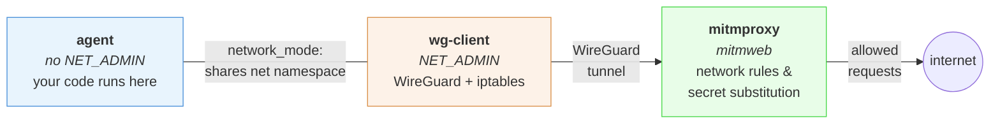
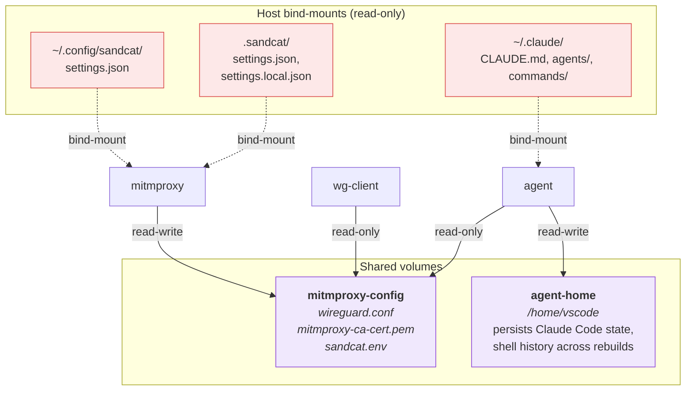
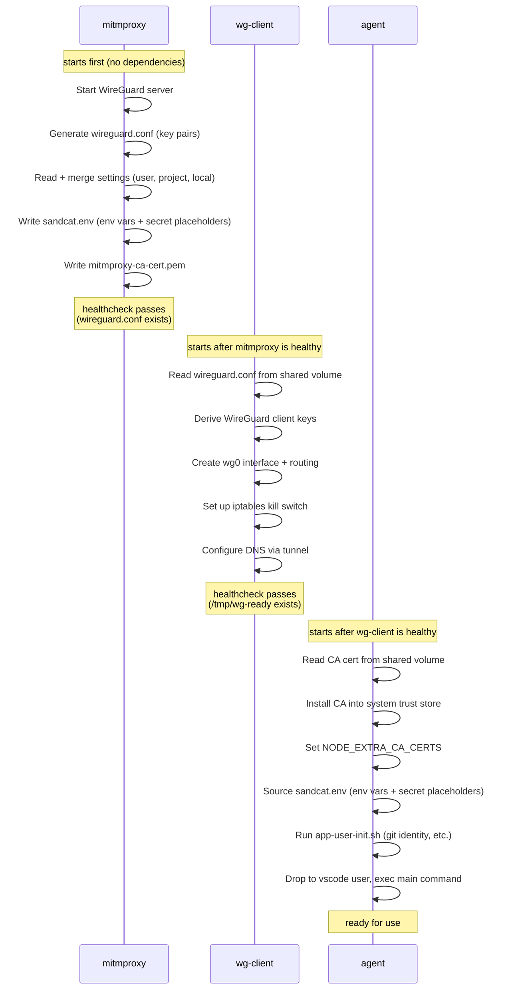

# Sandcat

Sandcat is a Docker & [dev container](https://containers.dev) setup for securely
running AI agents. The environment is sandboxed, with controlled network access
and transparent secret substitution. All of this is done while retaining the
convenience of working in an IDE like VS Code.

All container traffic is routed through a transparent
[mitmproxy](https://mitmproxy.org/) via WireGuard, capturing HTTP/S, DNS, and
all other TCP/UDP traffic without per-tool proxy configuration. A
straightforward allow/deny list-based engine controls which network requests go
through, and a secret substitution system injects credentials at the proxy level
so the container never sees real values.

This repository contains:

* a bash CLI to initialize the sandbox for a project, copying and customizing
  the necessary files (see `cli/`)
* reusable proxy definitions under `cli/templates/devcontainer/sandcat/`:
  `Dockerfile.wg-client`, `compose-proxy.yml`, and `scripts/` that perform the
  network filtering & secret substitution
* template application and dev container configuration under
  `cli/templates/devcontainer/`: `Dockerfile.app`, `compose-all.yml`,
  `devcontainer.json`. This should be fine-tuned for each project and specific
  development stack, to install required tools and dependencies.

Sandcat can be used as a devcontainer setup, or standalone, providing a shell
for secure development.

> Sandcat is part of [Visdom](https://virtuslab.com/services/visdom),
> VirtusLab's AI-driven software delivery infrastructure.

## Quick start

### 1. Install sandcat CLI

The [CLI](cli/README.md) is a helper script and thin wrapper around
docker-compose that simplifies the process of initializing and starting the
sandbox.

It has two main tasks:
* copy the necessary configuration files from the `cli/templates` directory into
  your project and customize them based on your choices (development stack,
  etc.)
* run `docker compose` commands with the correct compose file automatically
  detected, so you don't have to remember the file names or paths.

The CLI can itself be run through a docker image that we publish to our
repository, so that no local installation is required; or installed locally by
cloning this git repository.

#### Run as docker image (recommended)

```bash
# Pull the image to local docker
docker pull ghcr.io/virtuslab/sandcat

# Add to your .bashrc or .zshrc
alias sandcat='docker run --rm -it -v "/var/run/docker.sock:/var/run/docker.sock" -v"$PWD:$PWD" -v"$HOME/.config/sandcat:$HOME/.config/sandcat" -w"$PWD" -e TERM -e HOME ghcr.io/virtuslab/sandcat'
```

The CLI needs access to your current directory (to copy project configuration),
the host Docker socket (to manage sandbox containers), your user config
directory (`~/.config/sandcat/` to initialize the settings file), and a couple
of environment variables (`TERM` for terminal handling, `HOME` so Docker Compose
can resolve `~` in volume mounts).

Using the Docker image disables the editor integration (`vi` installed in the
image will be used instead of your host editor). Host environment variables are
not forwarded unless you add `-e` flags explicitly.

The image runs as root, to avoid permission issues with the host Docker socket.
On Colima file ownership is mapped automatically, on Linux you should add
`--user` parameter accordingly.

#### Local install

```bash
# Clone the repo
git clone https://github.com/VirtusLab/sandcat.git

# Add the sandcat bin directory to your path (add this to your .bashrc or .zshrc)
export PATH="$PWD/sandcat/cli/bin:$PATH"
```

`yq` is required to edit compose files. Sandcat uses [Mike Farah's Go `yq`](https://github.com/mikefarah/yq); the unrelated Python `yq` (kislyuk/yq) is **not** compatible.

On Debian/Ubuntu, `apt install yq` installs the Python variant. Install Mike Farah's `yq` instead — for example `snap install yq`, or download a binary from the [release page](https://github.com/mikefarah/yq/releases). Homebrew, Alpine `apk`, and the project's own Docker image already ship the correct one.

### 2. Initialize the sandbox for your project

```bash
sandcat init
```

This prompts you to select the agent type, IDE (for devcontainer mode), and
development stacks to install. You can also pass flags to skip prompts:

```bash
sandcat init --agent claude --ide vscode --stacks "python,node"

# With optional features (proxy TUI, 1Password integration)
sandcat init --secret-provider 1password --agent claude --ide vscode
```

Available stacks: `node`, `python`, `java`, `rust`, `go`, `scala`, `ruby`,
`dotnet`, `zig`. Versions default to LTS where available (e.g. Node.js LTS,
Java LTS 25). To change a version for a single project, add the desired
package to `.devcontainer/devbox.tools.json` — see [Stack and tool packages
via devbox](#stack-and-tool-packages-via-devbox) below for how tool entries
override stack defaults.

Selecting `scala` automatically includes `java` as a dependency. Stacks also
install the corresponding VS Code extension (e.g. `rust-analyzer` for Rust,
`metals` for Scala).

#### Stack and tool packages via devbox

All packages inside the sandbox — both stack toolchains and user tools —
are managed with [devbox](https://www.jetify.com/devbox), which resolves
them from Nix. `sandcat init` generates two config files side by side in
`.devcontainer/`:

**`devbox.stack.json`** — sandcat-managed. Regenerated on every
`sandcat init` from the `--stacks` selection plus a baseline of shell tools
every sandbox needs (`fd`, `fzf`, `gh`, `jq`, `ripgrep`, `tmux`, `vim`).
Do not edit by hand — your changes will be overwritten on the next init.

**`devbox.tools.json`** — user-managed. Written once with an empty
`packages` list; subsequent `sandcat init` invocations leave it untouched.
Add project-specific tools here.

At image build time the two files are merged into a single devbox global
config. `devbox.tools.json` wins over `devbox.stack.json` on:

* **Same package name** — the `@` prefix. Put `nodejs@22.5.1` in tools
  to replace the stack's `nodejs@lts`.
* **Cross-family collisions** — tools packages providing the same file
  as a stack package win too. Put `openjdk17@latest` in tools to make
  it the active Java over the stack's `temurin-bin-25@latest`; the
  agent's `java`, `JAVA_HOME` and the injected mitmproxy CA all
  resolve to the tools JDK.

Non-overriding tools entries just add to the merged config. Search
available packages on [nixhub.io](https://www.nixhub.io/).

Example — give the agent [yq](https://github.com/mikefarah/yq),
[shellcheck](https://www.shellcheck.net/), and
[hyperfine](https://github.com/sharkdp/hyperfine) by dropping them into
`devbox.tools.json`:

```json
{
  "packages": ["yq-go@latest", "shellcheck@latest", "hyperfine@latest"]
}
```

Then rebuild the agent image:

```bash
sandcat run --build
# or, without starting the full stack:
docker compose -f .devcontainer/compose-all.yml build agent
```

Every shell inside the sandbox — including the agent's — picks up the
packages on `PATH`. Iterating on `devbox.tools.json` is the fast path:
the stack install layer stays cached and only the delta downloads
(typically seconds).

Installs are build-time only: `devbox add` inside the sandbox is not
supported, and no Nix download hosts are added to the network allowlist.
To pin the exact package versions across environments, commit
`.devcontainer/devbox.lock` next to the JSON files; the build picks it up
automatically.

Optional volume mounts (agent config, `.git`, `.idea`) are written into the
generated `.devcontainer/compose-all.yml`. See [Customizing optional volume
mounts](#customizing-optional-volume-mounts) below. For scripted `sandcat init`,
set `SANDCAT_*` environment variables (see the [CLI README](cli/README.md)).

#### Customizing optional volume mounts

`sandcat init` adds optional bind-mounts to `services.agent.volumes` in
`.devcontainer/compose-all.yml`. Each mount is an independent line — you can
enable or disable **individual paths** by editing that file after init. This
works the same way for Claude and Cursor; there are no per-folder `sandcat init`
flags today.

**All-or-nothing at init time** (scripted workflows only):

| Agent     | Environment variable          | Default                                 |
|-----------|-------------------------------|-----------------------------------------|
| Claude    | `SANDCAT_MOUNT_CLAUDE_CONFIG` | `true`                                  |
| Cursor    | `SANDCAT_MOUNT_CURSOR_CONFIG` | `true`                                  |
| Any       | `SANDCAT_MOUNT_GIT_READONLY`  | `false` (commented in compose)          |
| JetBrains | `SANDCAT_MOUNT_IDEA_READONLY` | `false` (active when `--ide jetbrains`) |
| Any       | `SANDCAT_MOUNT_SHARED_CACHE`  | `true` — see [Shared dependency caches](#shared-dependency-caches) |
| Any       | `SANDCAT_GITIGNORE`           | `true` (see [Gitignore defaults](#gitignore-defaults)) |

When an agent mount flag is `false`, Sandcat lists every path as a foot comment
on the first volume entry — copy the lines you want into the active `volumes:`
list.

**Per-path tuning (recommended):** edit `.devcontainer/compose-all.yml`, remove
or comment out mounts you do not want, then rebuild/reopen the devcontainer:

```yaml
# Mount a different workspace's Cursor transcripts (not recommended):
# - ${HOME}/.cursor/projects/workspaces-other-project:/home/vscode/.cursor/projects/workspaces-other-project
```

**Do not re-run `sandcat init`** unless you intend to reset generated files —
it recopies the template and overwrites manual compose edits. Commit your
customized `compose-all.yml` to keep changes across the team.

**Claude paths** (host `~/.claude/`, read-only when mounted):

- `CLAUDE.md`, `agents/`, `commands/`

**Cursor paths** (host `~/.cursor/`):

| Path                                                                                         | Mode       | Typical use                           |
|----------------------------------------------------------------------------------------------|------------|---------------------------------------|
| `AGENTS.md`, `rules/`, `skills/`, `commands/`, `hooks.json`, `hooks/`, `agents/`, `mcp.json` | read-only  | Shared customization                  |
| `projects/<workspace-id>/`                                                                   | read-write | This sandbox's transcripts/terminals  |

Sandcat mounts only `projects/<workspace-id>/` for the current sandbox
(`workspaces-<project-name>`), not the whole host `projects/` tree. `chats/`,
`plugins/`, and `subagents/` stay in `agent-home` so other workspaces' runtime
state is not exposed.

Cursor CLI keys Sandcat manages (`cursor.cli` in settings) are **not**
host-mounted — see the Cursor section below.

**Project-local config** (per repository, via the workspace code mount — not
controlled by `SANDCAT_MOUNT_*_CONFIG`):

- Claude: `.claude/` in the repo (skills, agents, etc.)
- Cursor: `.cursor/` in the repo (rules, skills, agents, `cli.json`, etc.)

Use host mounts for personal defaults shared across sandboxes; use repo
`.claude/` or `.cursor/` for project-specific or team-shared customization.

**Isolation notes:** host `~/.claude/` and shared Cursor customization mounts
(`rules/`, `skills/`, etc.) are one profile per user on the machine — all
sandcat projects on that host see the same mounted trees. Cursor transcripts for
this sandbox persist under host `projects/<workspace-id>/` only
(`workspaces-<project-name>`). Other workspaces' `projects/`, plus `chats/`,
`plugins/`, and `subagents/`, are not mounted. To keep a sandcat project fully
isolated from host agent state, set `SANDCAT_MOUNT_<AGENT>_CONFIG=false` and
rely on repo-local config plus the `agent-home` volume inside the container.

#### Shared dependency caches

For stacks that download a lot of common dependencies, sandcat mounts a set
of **host-scoped named volumes** so `cats-effect`, `spring-boot`, etc.
downloaded in one project are instantly available in every other project on
the same host. Otherwise each sandbox re-downloads and re-stores the same
JAR trees inside its own `agent-home`, adding several GB per project.

The cache set is picked **per stack** — a project without a matching stack
gets no shared cache mounts at all. Today only the JVM stack (`--stacks java`,
also pulled in by `scala`) contributes cache entries; other language stacks
are not supported now.

Java/Scala cache mounts (all under `/home/vscode/` in the container):

| Path                        | Cache for                                             |
|-----------------------------|-------------------------------------------------------|
| `.m2/repository/`           | Maven local repository                                |
| `.cache/coursier/`          | Coursier — sbt (modern), scala-cli, Metals            |
| `.gradle/caches/`           | Gradle dependency cache                               |
| `.gradle/wrapper/dists/`    | Gradle Wrapper distributions                          |
| `.ivy2/cache/`              | Ivy — legacy sbt (pre-Coursier resolver)              |
| `.sbt/boot/`                | sbt bootstrap (sbt binaries + Scala compiler)         |

Each is a Docker named volume with a stable host-wide name
(`sandcat-cache-maven`, `sandcat-cache-coursier`, …) declared as
`external: true` in the generated `compose-all.yml`. Multiple sandcat compose
projects reference the same physical volume, and `sandcat compose down -v` on
one project will **not** wipe caches other projects rely on. The `sandcat run`
wrapper creates them lazily via `docker volume create` (idempotent), so no
manual setup is required.

Only `/home/vscode/.m2/repository/` is shared, not the whole `.m2/` — user
config like `settings.xml` stays per-project inside `agent-home`. Same pattern
for `.gradle/` (only `caches/` and `wrapper/dists/`, not `daemon/` or
`init.d/`) and `.ivy2/` (only `cache/`, not `local/` where `sbt publishLocal`
outputs live).

**Opt out per project:**

```bash
sandcat init --features no-shared-cache ...      # interactive selection also
                                                  # exposes it in the menu
```

Or set the env var before init (equivalent to the feature flag):

```bash
SANDCAT_MOUNT_SHARED_CACHE=false sandcat init ...
```

With shared cache disabled, the mount lines stay in `compose-all.yml` as
comments — you can flip individual ones back on by uncommenting.

**Trade-offs to be aware of:**

* Shared caches break sandcat's per-project isolation model for those specific
  paths. If one project's build corrupts a JAR (rare — Maven and Coursier both
  do content-hash validation), other projects using shared cache pick up the
  corruption. Disable per project if you need hermetic isolation (regulated
  environments, security-sensitive projects).
* Two parallel builds writing the same artifact rely on the tools' own file
  locking (Maven `.locks/`, Coursier per-artifact `.lock`, Gradle `.lock`).
  This works reliably in practice but is not sandcat-mediated.

**Managing shared caches:**

```bash
# Detailed table — volume name, size, file count, running container users
sandcat cache list
sandcat cache          # same as `list`

# Quick total across all shared-cache volumes
sandcat cache size

# Wipe one (next build re-downloads what the project needs)
sandcat cache rm sandcat-cache-maven

# Wipe them all — resets every shared cache on the host
sandcat cache rm --all
```

`sandcat cache rm` refuses to remove a volume that a running sandbox
still mounts; stop the sandbox first, or pass `--force` to bypass the
check (Docker will then error out if the volume is truly locked).

#### Gitignore defaults

When the project has a `.git/` directory, `sandcat init` appends a
`# Sandcat` block to `.gitignore` (creating the file if needed) so
users don't accidentally commit files that are either regenerated on
next init or per-machine:

```gitignore
# Sandcat
.devcontainer/*
!.devcontainer/devbox.tools.json
.sandcat/settings.local.json
# /Sandcat
```

The `!.devcontainer/devbox.tools.json` negation keeps the user-managed
tool list in git — it's the project-shared extension of the stack (see
[Stack and tool packages via devbox](#stack-and-tool-packages-via-devbox))
and travels with the repo even though everything else under
`.devcontainer/` is ignored.

The block is bracketed by `# Sandcat` / `# /Sandcat` sentinels so
sandcat can manage it symmetrically: enabling on a subsequent init is
a no-op when the block is already present, and disabling **removes**
the block cleanly (preserving your other rules).

**Opt out** if you'd rather keep the generated files in git (e.g. team
convention where each dev clones a ready-to-run devcontainer without
re-running `sandcat init`):

```bash
sandcat init --features no-gitignore ...
SANDCAT_GITIGNORE=false sandcat init ...
```

Both are equivalent — the env var is the scripted counterpart of the
interactive/CSV feature flag. If a Sandcat block already exists in
`.gitignore`, opting out on a re-init deletes the block (and, when
the block was the file's only content, deletes the file too). Rules
outside the sandcat markers are always preserved.

If the project is not a git working tree (no `.git/` directory), init
silently skips the gitignore step — no `.gitignore` gets created.

### 3. Start the sandbox

**CLI mode:**

```bash
# Open a shell in the agent container
sandcat run

# Rebuild images first (after editing Dockerfile.app or scripts)
sandcat run --build

# Start your agent cli (e.g. claude). Because you're in a sandbox, you can use yolo mode!
# (an alias for --dangerously-skip-permissions)
claude-yolo
```

**Attaching to a running container:**

If the sandbox is already running (e.g. started by VS Code's devcontainer integration or
another terminal), use `attach` to open an additional shell in it without starting a new
container:

```bash
sandcat attach           # opens bash --login
sandcat attach <cmd>     # runs <cmd> directly, e.g. sandcat attach zsh
```

Unlike `sandcat run`, this connects to an existing container rather than starting a fresh one.
It uses `find_compose_file` to locate the correct project, so it works reliably even when
multiple sandboxes are running in parallel.

### Customizing the generated files

**`compose-all.yml`** — `network_mode: "service:wg-client"` routes all traffic
through the WireGuard tunnel. The `mitmproxy-config` volume gives your container
access to the CA cert, env vars, and secret placeholders. The agent-specific
config bind-mounts (for example `~/.claude/*` or `~/.cursor/*`) forward host
customizations — remove any mount whose
source does not exist on your host.

**`Dockerfile.app`** — installs everything the sandbox needs via
[devbox](https://www.jetify.com/devbox), a wrapper over Nix. Stack
toolchains and user tools are merged from `devbox.stack.json` +
`devbox.tools.json` into a single devbox global profile at build time —
see [Stack and tool packages via devbox](#stack-and-tool-packages-via-devbox)
for the two-file model. Some runtimes need extra configuration to trust
the mitmproxy CA — see [TLS and CA certificates](#tls-and-ca-certificates).

**`devcontainer.json`** — includes VS Code hardening settings (credential socket
cleanup, workspace trust, disabled local terminal). See [Hardening the VS Code
setup](#hardening-the-vs-code-setup) for details.

## Settings format

Settings are loaded from up to three files (highest to lowest precedence):

| File | Scope | Git |
|------|-------|-----|
| `.sandcat/settings.local.json` | Per-project overrides | **Ignored** (add to `.gitignore`) |
| `.sandcat/settings.json` | Per-project defaults | Committed |
| `~/.config/sandcat/settings.json` | User-wide defaults | N/A |

All three files use the same JSON format. Missing files are silently skipped. If
no files exist, the addon disables itself.

**Merge rules:**
- `env` — merged; higher-precedence values overwrite lower ones.
- `secrets` — merged; higher-precedence entries overwrite lower ones.
- `network` — concatenated; highest-precedence rules come first. Since rules are
  evaluated top-to-bottom with first-match-wins, this means local rules take
  priority over project rules, which take priority over user rules.
- `dns_servers` — last-wins; the highest-precedence layer that sets the key
  replaces the entire list (see [DNS resolution](#dns-resolution)).

A typical setup keeps user-specific settings (git identity, API keys) in the
user file, project-wide network rules in the project file, and developer
overrides in the local file:

`~/.config/sandcat/settings.json` (user — created by `sandcat init` on first
run):

```json
{
  "env": {
    "GIT_USER_NAME": "Your Name",
    "GIT_USER_EMAIL": "you@example.com"
  },
  "secrets": {
    "ANTHROPIC_API_KEY": {
      "value": "sk-ant-real-key-here",
      "hosts": ["api.anthropic.com"]
    },
    "GITHUB_TOKEN": {
      "value": "ghp_your-token-here",
      "hosts": ["github.com", "*.github.com", "*.githubusercontent.com"]
    }
  },
  "network": [
    {"action": "allow", "host": "*.github.com"},
    {"action": "allow", "host": "github.com"},
    {"action": "allow", "host": "*.githubusercontent.com"},
    {"action": "allow", "host": "*.anthropic.com"},
    {"action": "allow", "host": "*.claude.ai"},
    {"action": "allow", "host": "*.claude.com"}
  ]
}
```

`.sandcat/settings.json` (project, committed):

```json
{
  "network": [
    {"action": "allow", "host": "*", "method": "GET"}
  ]
}
```

`.sandcat/settings.local.json` (project, git-ignored):

```json
{
  "network": [
    {"action": "allow", "host": "internal.corp.dev"}
  ]
}
```

With these files, the merged network rules are (local first, then project, then
user): allow `internal.corp.dev`, then the project wildcard GET rule, then the
user's GitHub/Anthropic rules. Env and secrets come from the user file since
neither project file defines them.

Warning: the default project settings allow all GET traffic, which means the
agent can read arbitrary web content — a vector for prompt injection. Stricter
settings would narrow this to known service domains. Note that the user-level
settings allow full access to GitHub, which can be used to read untrusted
content (prompt injection) or push data out (exfiltration). Malicious code might
also be generated as part of the project itself.

## Applying configuration changes

Mitmproxy reads settings files only at startup (no hot-reload), and the app
container sources `sandcat.env` only during its entrypoint. After editing any
settings file, you need to restart services for changes to take effect.

You can use the CLI helper commands:

```sh
sandcat edit project-settings   # project network rules (.sandcat/settings.json)
sandcat edit user-settings      # API keys, git identity (~/.config/sandcat/settings.json)
sandcat edit dockerfile         # container Dockerfile (.devcontainer/Dockerfile.app)
sandcat edit compose            # Docker Compose file (.devcontainer/compose-all.yml)
```

After editing a settings file, restart the proxy to apply changes:

```sh
sandcat restart-proxy
```

Note that VS Code's **Rebuild Container** only rebuilds the `agent` service — it
does not restart `mitmproxy` or `wg-client`. Use `sandcat restart-proxy` to
apply settings changes.

## Network access rules

The `network` array defines ordered access rules evaluated top-to-bottom. First
matching rule wins (like iptables). If no rule matches, the request is
**denied**.

Each rule has:
- `action` — `"allow"` or `"deny"` (required)
- `host` — glob pattern via fnmatch (required)
- `method` — HTTP method to match; omit to match any method (optional)

### Default settings

`sandcat init` creates two settings files automatically:

- **User settings** (`~/.config/sandcat/settings.json`) — allows full access to
  GitHub and Anthropic/Claude, with empty API key placeholders. This is a
  liberal default: the agent can read arbitrary GitHub content (prompt injection
  vector) and push data (exfiltration vector).
- **Project settings** (`.sandcat/settings.json`) — allows all GET traffic to
  any host. This means the agent can read arbitrary web content, which is a
  prompt injection vector.

For stricter configurations, edit the settings files to limit allowed domains.
Common additions for specific stacks:

| Stack | Domains |
|-------|---------|
| VS Code | `update.code.visualstudio.com`, `marketplace.visualstudio.com`, `*.vsassets.io`, `main.vscode-cdn.net` |
| npm | `registry.npmjs.org` |
| PyPI | `pypi.org`, `files.pythonhosted.org` |
| Rust / Cargo | `crates.io`, `static.crates.io` |
| Java / Maven | `repo.maven.apache.org`, `repo1.maven.org` |
| JetBrains | `plugins.jetbrains.com`, `downloads.marketplace.jetbrains.com` |

### DNS filtering

DNS queries are checked against the same network rules as HTTP requests. If a
hostname is not allowed by any rule, the DNS lookup is refused — the container
never learns the IP address. This prevents DNS-based exfiltration even when HTTP
to that host would be blocked.

Because DNS has no HTTP method, method-specific rules are matched on host only.
A rule like `{"action": "allow", "host": "*", "method": "GET"}` will also allow
DNS resolution for any host. Rule ordering matters: a method-specific deny rule
will block DNS for that host even if a later rule would allow other methods.

### Examples

With the liberal template rules:
- `GET` to any host → **allowed** (rule 1)
- DNS lookup for any host → **allowed** (rule 1 matches on host)
- `POST` to `api.github.com` → **allowed** (rule 2)
- `POST` to `api.anthropic.com` → **allowed** (rule 4)
- `POST` to `example.com` → **denied**
- Empty network list → all requests **denied** (default deny)

## DNS resolution

Queries that aren't refused by the network rules are resolved by a small
`dnsmasq` running inside `wg-client`, which splits traffic two ways: sibling
containers go to Docker's embedded resolver locally, everything else goes
through the WireGuard tunnel to mitmproxy and out via the configured upstream.

### Custom upstream DNS — `dns_servers`

Top-level optional array of IPv4/IPv6 addresses. Overrides the upstream DNS
servers used by the WireGuard tunnel. Point this at a corporate/intranet
resolver to make internal hostnames (e.g. `*.corp.example.com`) work inside
the sandbox. Empty list, omitted, or explicit `null` falls back to `1.1.1.1`
and `8.8.8.8`. Hostnames are not accepted (resolv.conf `nameserver` directives
require numeric IPs); invalid entries are skipped with a warning.

```json
{
  "dns_servers": ["10.20.0.10", "10.20.0.11"]
}
```

Higher-precedence layers replace the entire list; they are not merged. Setting
`"dns_servers": null` in a higher layer resets back to defaults regardless of
what a lower layer set. Run `sandcat restart-proxy` after editing.

### Container-to-container DNS

The agent can resolve sibling containers on the same Docker compose network by
name (e.g. a `db:` service in `compose.yml` is reachable as `db`). Queries
under the compose project's network (the `search` domain Docker assigns to
the container) go to Docker's embedded resolver at `127.0.0.11`. No
configuration is required.

The agent shares wg-client's network namespace via `network_mode` but Docker
still gives each container its own `/etc/resolv.conf` in its own mount
namespace. wg-client publishes its resolv.conf onto a shared `wg-runtime`
volume mounted read-only at `/run/sandcat` in the agent, and `app-init.sh`
copies it into `/etc/resolv.conf` on startup so the agent's lookups also go
through the local dnsmasq.

To prevent the search-domain carve-out from becoming a DNS exfiltration
channel — where an attacker-crafted name like `<payload>.<project>_default`
would otherwise be forwarded by Docker's embedded resolver to the host's
upstream DNS, bypassing mitmproxy — wg-client is launched with a `dns:` sink
(RFC 5737 `192.0.2.1`). Sibling names still resolve locally; anything else
under the search domain fails fast without leaving the host.

## Secret substitution

Dev containers never see real secret values. Instead, environment variables
contain deterministic placeholders (`SANDCAT_PLACEHOLDER_<NAME>`), and the
mitmproxy addon replaces them with real values when requests pass through the
proxy.

Inside the container, `echo $ANTHROPIC_API_KEY` prints
`SANDCAT_PLACEHOLDER_ANTHROPIC_API_KEY`. When a request containing that
placeholder reaches mitmproxy, it's replaced with the real key — but only if the
destination host matches the `hosts` allowlist.

### Host patterns

The `hosts` field accepts glob patterns via `fnmatch`:

- `"api.anthropic.com"` — exact match
- `"*.anthropic.com"` — any subdomain
- `"*"` — allow all hosts (use with caution)

### Leak detection

If a placeholder appears in a request to a host **not** in the allowlist,
mitmproxy blocks the request with HTTP 403 and logs a warning. This prevents
accidental secret leakage to unintended services.

### 1Password integration

Instead of storing secret values directly in settings files, you can reference
secrets stored in 1Password using `op://` references:

```json
{
  "secrets": {
    "ANTHROPIC_API_KEY": {
      "op": "op://Private/Anthropic API Key/credential",
      "hosts": ["api.anthropic.com"]
    }
  }
}
```

Each secret entry must have either `"value"` (plain text) or `"op"` (1Password
reference), not both. You can mix both styles in the same settings file.

The mitmproxy addon resolves `op://` references at startup using the `op` CLI.
To enable 1Password during project setup, select it from the optional features
prompt, or pass the flag:

```bash
sandcat init --secret-provider 1password
```

This switches the mitmproxy service to
`ghcr.io/virtuslab/sandcat-mitmproxy-op`, a pre-built image that includes the
`op` CLI.

**Authentication.** The `op` CLI inside the container authenticates via a
[1Password service account](https://developer.1password.com/docs/service-accounts/).
To set one up:

1. Go to [1Password Developer Tools > Service
   Accounts](https://my.1password.com/developer-tools/infrastructure-secrets/serviceaccount/)
   and create a new service account
2. Grant it read access to the vault(s) containing your secrets
3. Add the token to `~/.config/sandcat/settings.json`:

```json
{
  "op_service_account_token": "ops_...",
  "secrets": {
    "ANTHROPIC_API_KEY": {
      "op": "op://Private/Anthropic API Key/credential",
      "hosts": ["api.anthropic.com"]
    }
  }
}
```

The token is read from the settings file by the mitmproxy addon at startup. If
`op_service_account_token` is not set in settings, the addon falls back to the
`OP_SERVICE_ACCOUNT_TOKEN` environment variable (forwarded from the host shell
into the container).

Secret resolution happens once at mitmproxy startup — run `sandcat
restart-proxy` after changing 1Password items.

### How it works internally

1. The mitmproxy container mounts `~/.config/sandcat/settings.json` (read-only)
   and the project's `.sandcat/` directory (read-only) alongside the addon
   script. The addon comes in two agent-specific variants
   (`mitmproxy_addon_claude.py`, `mitmproxy_addon_cursor.py`) that share their
   common logic via the `mitmproxy_addon_common.py` library.
2. On startup, the addon reads all available settings files (user, project,
   local), merges them according to the precedence rules above, and writes
   `sandcat.env` to the `mitmproxy-config` shared volume
   (`/home/mitmproxy/.mitmproxy/sandcat.env`). This file contains plain env vars
   (e.g. `export GIT_USER_NAME="Your Name"`) and secret placeholders (e.g.
   `export ANTHROPIC_API_KEY="SANDCAT_PLACEHOLDER_ANTHROPIC_API_KEY"`).
3. App containers mount `mitmproxy-config` read-only at `/mitmproxy-config/`.
   The shared entrypoint (`app-init.sh`) sources `sandcat.env` after installing
   the CA cert, so every process gets the env vars and placeholder values.
4. On each request, the addon first checks network access rules. If denied, the
   request is blocked with 403.
5. If allowed, the addon checks for secret placeholders in the request, verifies
   the destination host against the secret's allowlist, and either substitutes
   the real value or blocks the request with 403 (leak detection).

Real secrets never leave the mitmproxy container.

### Disabling

Remove all settings files. If no settings file exists at any layer, the addon
disables itself — no network rules are enforced and `sandcat.env` is not
written.

### Claude Code

Claude Code supports two authentication methods inside the container:

- **API key** — add an `ANTHROPIC_API_KEY` secret to `settings.json`. The
  entrypoint detects the key and seeds `~/.claude.json` with
  `{"hasCompletedOnboarding": true}` so Claude Code uses it without interactive
  setup.
- **Subscription (browser login)** — omit `ANTHROPIC_API_KEY` from
  `settings.json`. On first run Claude Code will display a URL and a code. Open
  the URL in a browser on your host machine, enter the code, and authenticate
  there — the container itself cannot open a browser.

**Autonomous mode.** The bundled `devcontainer.json` enables
`claudeCode.allowDangerouslySkipPermissions` and sets
`claudeCode.initialPermissionMode` to `bypassPermissions`. This lets Claude Code
run without interactive permission prompts inside the container. The trade-off:
sandcat already provides the security boundary (network isolation, secret
substitution, iptables kill-switch), so the in-container prompts add friction
without meaningful security benefit. Remove these settings if you prefer
interactive approval. See [Secure & Dangerous Claude Code + VS Code
Setup](https://warski.org/blog/secure-dangerous-claude-code-vs-code-setup/) for
background on this approach.

**Host customizations.** The example `compose-all.yml` bind-mounts
`~/.claude/CLAUDE.md`, `~/.claude/agents`, and `~/.claude/commands` from the
host (read-only) so your personal instructions, custom agents, and slash
commands are available inside the container. Remove any mount whose source does
not exist on your host — Docker will otherwise create an empty directory in its
place.

**Multi-line prompts.** Composing a multi-line prompt with `⌘+Enter` does not
work on macOS — the terminal reserves the `⌘` modifier and never transmits it
over the PTY, so `sandcat attach` (and Claude Code) only ever receive a plain
`Enter`. This is not sandcat-specific and cannot be fixed inside the container.
Use one of these instead:

- **`\` then `Enter`** — inserts a newline in any terminal with no setup. The
  simplest option.
- **`Option+Enter`** — Claude Code's macOS default. In Apple Terminal, first
  enable *Settings → Profiles → Keyboard → Use Option as Meta key*; iTerm2 sends
  it out of the box.
- **`Shift+Enter`** — the most familiar combination, but Claude Code only
  receives whatever bytes the terminal chooses to send for it, so it needs a
  one-time mapping in the **host** terminal. Claude Code's `/terminal-setup` is
  meant to install this, but it has two traps in this setup: it configures the
  host terminal, so running it from Claude Code *inside* the sandbox does
  nothing; and it caches an "installed" flag, so a second run reports *"already
  enabled"* even when the terminal was never actually changed. The reliable route
  is to map the key by hand:
  - **iTerm2** — Settings → Keys → Key Bindings → `+`, record `Shift+Enter`,
    choose *Send Hex Codes* and enter `0x1b 0x0d` (this is `Option+Enter`, which
    Claude Code treats as a newline). GUI bindings take effect immediately. To
    confirm it worked, run `cat -v` in the sandbox shell and press `Shift+Enter`:
    it should print `^[` instead of a blank line.
  - **VS Code integrated terminal** — add to `keybindings.json`:

    ```json
    { "key": "shift+enter",
      "command": "workbench.action.terminal.sendSequence",
      "args": { "text": "\u001b\r" },
      "when": "terminalFocus" }
    ```

### Cursor CLI

Cursor CLI support is available via `sandcat init --agent cursor`.

- The current template uses temporary compatibility defaults for auth/network:
  - **Auth passthrough via placeholder substitution.** The container sees only
    `SANDCAT_PLACEHOLDER_CURSOR_API_KEY`; the real `CURSOR_API_KEY` is injected
    by the mitmproxy addon only for allowed Cursor hosts.
  - **HTTP/1 compatibility bootstrap.** On startup, Sandcat forces
    `.network.useHttp1ForAgent = true` in Cursor CLI config to avoid known
    proxy/TLS instability with HTTP/2 streaming through mitmproxy.
  - **Proxy command defaults tuned for Cursor.** The generated proxy config uses
    the Cursor addon and keeps mitmproxy HTTP/2 enabled (`http2=true`) (plus
    streaming-safe mitmproxy
    flags such as `stream_large_bodies=1m`, `connection_strategy=lazy`,
    `anticomp=true`, and `timeout_read=300`).

    Those streaming-safe flags are **Cursor-only** — they are intentionally
    omitted on the Claude path (`sct_agent_mitm_streaming_flags`). With
    `stream_large_bodies` unset, mitmproxy buffers request bodies up to ~1 MB
    before forwarding, which lets the addon's `_substitute_secrets` run a
    body-content scan for placeholder leaks. Setting them on Claude would
    weaken that defence-in-depth check; on Cursor they are required to keep
    Connect/HTTP-2 streaming responses stable, and the body-leak check is
    instead enforced via header/URL scans plus the textual-only body-mutation
    gate (binary protobuf bodies are left untouched).
  - **Streaming detection is path-only.** The Cursor addon decides whether a
    request is streaming purely from the request path
    (`/agent.v1.AgentService/Run*`, `/aiserver.v1.RepositoryService/...`).
    A client-supplied `content-type: application/connect+proto` header alone
    is **not** sufficient — accepting it would let any request with the right
    header bypass body substitution and the placeholder leak check.
  These defaults are conservative and may be relaxed when Cursor proxy behavior
  is consistently stable across environments.
- **Authentication:** put the Cursor API key in `secrets.CURSOR_API_KEY` in
  Sandcat settings (not in `cursor.cli`). The agent container receives only
  `SANDCAT_PLACEHOLDER_CURSOR_API_KEY` via `sandcat.env`; mitmproxy substitutes
  the real key on allowed Cursor hosts (see placeholder substitution above).
  Do not use `agent login` in the sandbox unless you accept that Cursor may
  store session state under agent-home outside Sandcat's placeholder model.
- **Cursor CLI settings via Sandcat:** add a `cursor.cli` block to
  `~/.config/sandcat/settings.json` (or project `.sandcat/settings.json`) using
  the same JSON shape as Cursor's global `cli-config.json` (permissions, model,
  network flags — not API keys). Sandcat merges settings layers at mitmproxy
  startup, writes `/mitmproxy-config/cursor-cli-config.json`, and the agent
  deep-merges that fragment into `cli-config.json` in agent-home on each start.
  Sandcat-owned keys win; other Cursor-written keys in that file (model choice,
  permissions allow/deny lists, etc.) are preserved. The Cursor user template
  defaults include `cursor.cli.network.useHttp1ForAgent: true` for mitmproxy
  stability.
- `SANDCAT_MOUNT_CURSOR_CONFIG=true` mounts host Cursor config into the agent
  container. Customization paths are read-only: `AGENTS.md`, `rules/`, `skills/`,
  `commands/`, `hooks.json`, `hooks/`, `agents/`, and `mcp.json`. Runtime state
  for this sandbox is read-write on the host under
  `projects/<workspace-id>/` only (`workspaces-<project-name>` — agent
  transcripts, terminals, MCP session state). `chats/`, `plugins/`, and
  `subagents/` are not host-mounted (they live in `agent-home`). On
  `sandcat init`, missing bind sources are pre-created on the host (directories
  via `mkdir`, JSON files with minimal valid defaults, markdown files empty) so
  Docker mounts a file instead of materialising a root-owned directory.
- **Config precedence:** `~/.config/sandcat/settings.json` governs network
  allowlists, secret substitution (mitmproxy), and Sandcat-managed Cursor CLI
  settings (`cursor.cli` — not credentials). Host Cursor customization mounts
  are read-only user config. The workspace-scoped `projects/<workspace-id>/`
  mount is read-write on the host. MCP servers in `mcp.json` still need
  matching mitmproxy allowlist entries before they can reach the network from
  the sandbox.
- **Cursor CLI TLS through mitmproxy.** The Cursor CLI bundles its own Node.js
  binary with compiled-in Mozilla CA roots. Sandcat sets
  `NODE_OPTIONS=--use-openssl-ca` so the bundled Node.js uses the system CA
  store (which includes the mitmproxy CA) instead of its built-in roots.
  When Cursor honors that environment setting, mitmproxy can intercept Cursor
  API traffic and perform `SANDCAT_PLACEHOLDER_CURSOR_API_KEY` substitution
  transparently.
- Provider-specific onboarding/bootstrap logic is intentionally minimal in this
  first iteration and can be extended in project-level Dockerfile/scripts.

## Architecture

### Containers and network



- **mitmproxy** runs `mitmweb --mode wireguard`, creating a WireGuard server and
  storing key pairs in `wireguard.conf`.
- **wg-client** is a dedicated networking container that derives a WireGuard
  client config from those keys, sets up the tunnel with `wg` and `ip` commands,
  and adds iptables kill-switch rules. Only this container has `NET_ADMIN`. No
  user code runs here.
- **App containers** share `wg-client`'s network namespace via `network_mode`.
  They inherit the tunnel and firewall rules but cannot modify them (no
  `NET_ADMIN`). They install the mitmproxy CA cert into the system trust store
  at startup so TLS interception works.
- The mitmproxy web UI is exposed on a dynamic host port (see below) to avoid
  conflicts when multiple projects include sandcat. Password: `mitmproxy`.

### Volumes

The containers communicate through two shared volumes and several bind-mounts
from the host:



- **`mitmproxy-config`** is the key shared volume. Mitmproxy writes to it
  (WireGuard keys, CA cert, `sandcat.env` with env vars and secret
  placeholders); all other containers mount it read-only.
- **`agent-home`** persists the vscode user's home directory across container
  rebuilds (Claude Code auth, shell history, git config).
- **Settings files** are bind-mounted from the host into mitmproxy only — app
  containers never see real secrets. The user settings file
  (`~/.config/sandcat/settings.json`) and the project settings directory
  (`.sandcat/`) are both mounted read-only.
- **Claude Code customizations** (`CLAUDE.md`, `agents/`, `commands/`) and
  **Cursor host config** (`~/.cursor/*` — see Cursor section above) are
  bind-mounted from the host when enabled in `compose-all.yml`. Per-path toggles
  are described in [Customizing optional volume mounts](#customizing-optional-volume-mounts).

### Startup sequence

The containers start in dependency order. Each step writes data to the shared
`mitmproxy-config` volume that the next step reads:



## Hardening the VS Code setup

Sandcat secures the **network path** out of the container, but VS Code's dev
container integration introduces a separate trust boundary. The VS Code remote
architecture gives container-side extensions access to host resources
(terminals, credentials, clipboard) through the IDE channel, bypassing
network-level controls entirely.

For background on these attack vectors see [Leveraging VS Code Internals to
Escape
Containers](https://blog.theredguild.org/leveraging-vscode-internals-to-escape-containers/).

### What the bundled devcontainer.json already does

The included `devcontainer.json` applies the following mitigations out of the
box:

- **Clears forwarded credential sockets** (`SSH_AUTH_SOCK`, `GPG_AGENT_INFO`,
  `GIT_ASKPASS`) via `remoteEnv` so container code cannot piggyback on host SSH
  keys, GPG signing, or VS Code's git credential helpers. Clearing env vars
  alone only hides the path — the socket file in `/tmp` can still be discovered
  by scanning.
- **Removes credential sockets** via a `postStartCommand` script that deletes
  `vscode-ssh-auth-*.sock` and `vscode-git-*.sock` from `/tmp` after VS Code
  connects. This is a best-effort measure — the socket path patterns could
  change in future VS Code versions.
- **Disables git config copying** (`dev.containers.copyGitConfig: false`) to
  prevent leaking host credential helpers and signing key references into the
  container.
- **Enables workspace trust** (`security.workspace.trust.enabled: true`) so VS
  Code prompts before applying workspace settings that container code could have
  modified via the bind-mounted project folder.
- **Blocks local terminal creation** (`terminal.integrated.allowLocalTerminal:
  false`) so container extensions cannot call
  `workbench.action.terminal.newLocal` to open a shell on the host, which would
  bypass the WireGuard tunnel entirely. For maximum protection, also set this in
  your **host** user settings (workspace settings could theoretically override
  it).
- **Read-only `.devcontainer` overlay** — `compose-all.yml` mounts the
  `.devcontainer` directory as a separate read-only bind mount on top of the
  writable project mount. This prevents the agent from modifying its own sandbox
  configuration (entrypoint scripts, Dockerfile, compose files,
  devcontainer.json).

### Consequences of hardening

Disabling credential forwarding and git config copying improves isolation but
requires a few adjustments.

**Git identity.** With `dev.containers.copyGitConfig` set to `false`, git inside
the container has no `user.name` or `user.email`. Add them to the `env` section
of your `settings.json`:

```json
"env": {
    "GIT_USER_NAME": "Your Name",
    "GIT_USER_EMAIL": "you@example.com"
}
```

The mitmproxy addon writes `env` entries to the shared env file (alongside
secret placeholders), and `app-user-init.sh` applies
`GIT_USER_NAME`/`GIT_USER_EMAIL` via `git config --global` at container startup.

**HTTPS remotes only.** SSH-based git operations won't work — `SSH_AUTH_SOCK` is
cleared and credential sockets are removed, so no SSH keys are available. The
entrypoint automatically rewrites GitHub SSH URLs to HTTPS via `git config
url.*.insteadOf`, so existing `git@github.com:` remotes work without manual
changes. Sandcat's secret substitution handles GitHub token authentication over
HTTPS transparently.

## Testing the proxy

The proxy mode is chosen during `sandcat init` via the optional features prompt,
or with `--features tui` / `--proxy tui`. Both modes run `sandcat proxy` from the host, in the project
directory.

**Web UI** (default, `--proxy web`) — opens a browser-based interface:

```sh
sandcat proxy              # prints the mitmweb URL and password
sandcat compose port mitmproxy 8081  # or look up the port manually
```

Log in with password `mitmproxy`.

**Console** (`--proxy tui`) — uses `mitmdump` to log flows as text:

```sh
sandcat proxy              # tails the mitmdump log (Ctrl+C to stop)
```

Useful in terminal-only environments (SSH sessions, remote servers) or when a
browser adds overhead.

To verify the kill switch blocks direct traffic:

```sh
# Should fail — iptables blocks direct eth0 access
curl --max-time 3 --interface eth0 http://1.1.1.1

# Should fail — no NET_ADMIN to modify firewall
iptables -F OUTPUT
```

To verify Docker-internal traffic works (e.g. a database or app service added to
the compose file):

```sh
# Should succeed — Docker network traffic is allowed
curl --max-time 3 http://my-service:8080
```

To verify host access is blocked:

```sh
# Should fail — gateway (host) is blocked
docker_gateway=$(ip -4 route show default dev eth0 | awk '{print $3}')
curl --max-time 3 "http://$docker_gateway"
```

To verify direct mitmproxy access is blocked:

```sh
# Should fail — mitmproxy container is only reachable via WireGuard
mitmproxy_ip=$(getent hosts mitmproxy | awk '{print $1}')
curl --max-time 3 "http://$mitmproxy_ip:8081"
```

To verify secret substitution for the GitHub token:

```sh
gh auth status
```

## Debugging

### Viewing proxy logs

Mitmproxy addon errors (network rule violations, secret resolution failures)
are written to stderr, visible via:

```sh
sandcat compose logs mitmproxy
```

In web mode, the mitmweb UI event log (accessible from the browser) also shows
addon warnings.

### Common issues

**`op read` failures (1Password).** If an `op://` reference can't be resolved
(wrong vault name, missing item, auth error), the addon logs a warning and sets
the secret value to empty. The container continues running — other secrets still
work. Check the logs to see the specific error:

```sh
sandcat compose logs mitmproxy | grep WARNING
```

**Container won't start.** If `mitmproxy` exits immediately, check its logs
first. Common causes:
- Settings JSON syntax error — the addon can't parse the file
- Missing settings file mount — verify `~/.config/sandcat/settings.json` exists

**Secrets not substituted.** If requests fail with auth errors even though
secrets are configured:
- Verify the secret has a non-empty value: `sandcat compose logs mitmproxy`
  shows how many secrets were loaded at startup
- Check that the destination host matches the secret's `hosts` allowlist
- Run `sandcat restart-proxy` after editing settings — the addon only reads
  settings at startup

**No network inside the container on some Wi-Fi networks.** If the sandbox has
no connectivity on one network but works on another, the network is likely
blocking outbound DNS (port 53) to the public resolvers sandcat uses by default
(`1.1.1.1`, `8.8.8.8`). This is common on corporate, hotel, and guest Wi-Fi,
which force their own resolver. The symptom is DNS-only: name lookups fail
inside the container while the host still browses fine (the host uses the
network's resolver; the container does not).

Fix: point the container at the network's own resolver via
[`dns_servers`](#custom-upstream-dns--dns_servers). First find the resolver IP:

```sh
# macOS
scutil --dns | awk '/nameserver\[0\]/ {print $3; exit}'
# Linux (systemd-resolved)
resolvectl status | awk '/Current DNS Server/ {print $4; exit}'
# Fallback: your default gateway is often the resolver
#   macOS:  route -n get default | awk '/gateway/{print $2}'
#   Linux:  ip route | awk '/default/{print $3; exit}'
```

Then set it in `.sandcat/settings.local.json` (local, not committed) — or
`~/.config/sandcat/settings.json` to cover all projects:

```json
{ "dns_servers": ["10.0.0.1"] }
```

The value is network-specific; update or remove it when you change networks.
Run `sandcat restart-proxy` to apply it (or `sandcat run` if the sandbox isn't
started yet).

**CA certificate issues.** If you see TLS errors inside the container, the
mitmproxy CA may not be trusted. See [TLS and CA
certificates](#tls-and-ca-certificates) for runtime-specific configuration.

## Unit tests

**Python tests** (mitmproxy addon):

```sh
pytest cli/test/mitmproxy/test_mitmproxy_addon.py -v
```

**BATS tests** (CLI):

```sh
cd cli && ./run-tests.bash
```

## Inspiration

Sandcat is mainly inspired by
[Matchlock](https://github.com/jingkaihe/matchlock), which provides similar
network isolation and secret substitution, however in the form of a dedicated
command line tool. While Matchlock VMs offer greater isolation and security,
they also lack the convenience of a dev containers setup, and integration with
an IDE.

[agent-sandbox](https://github.com/mattolson/agent-sandbox) implements a proxy
that runs alongside the container, however without secret substitution.
Moreover, the proxy is not transparent, instead relying on the more traditional
method of setting the `PROXY` environment variable.

Finally, Sandcat builds on the Docker+mitmproxy in WireGuard mode integration
implemented in
[mitm_wg](https://github.com/Srikanth0824/side-projects/tree/main/mitm_wg).

## Notes

### Why not wg-quick?

`wg-quick` calls `sysctl -w net.ipv4.conf.all.src_valid_mark=1`, which fails in
Docker because `/proc/sys` is read-only. The equivalent sysctl is set via the
`sysctls` option in `compose-proxy.yml`, and the entrypoint script handles
interface, routing, and firewall setup manually.

### TLS and CA certificates

Sandcat's mitmproxy intercepts TLS traffic, so the app container must trust the
mitmproxy CA. `app-init.sh` installs it into the system trust store, which is
enough for most tools — but some runtimes bring their own CA handling:

- **Node.js** bundles its own CA certificates and ignores the system store.
  `app-init.sh` sets `NODE_EXTRA_CA_CERTS` and
  `NODE_OPTIONS=--use-openssl-ca` automatically. The `--use-openssl-ca` flag
  is required for tools that bundle their own Node.js binary (e.g. Cursor CLI)
  where `NODE_EXTRA_CA_CERTS` alone may not be honored. If you write a custom
  entrypoint, make sure to include both or Node-based tools will fail TLS
  verification.
- **Rust** programs using `rustls` with the `webpki-roots` crate bundle CA
  certificates at compile time and will not trust the mitmproxy CA. Use
  `rustls-tls-native-roots` in reqwest so it reads the system CA store at
  runtime instead.
- **Java** uses its own trust store (`cacerts`) and ignores the system CA. The
  `Dockerfile.app` build step creates a version-independent `JAVA_HOME` symlink,
  copies the default `cacerts`, and writes `JAVA_HOME` and `JAVA_TOOL_OPTIONS`
  (with `-Djavax.net.ssl.trustStore`) to `.bashrc` so VS Code's `userEnvProbe`
  picks them up immediately. At container startup, `app-user-init.sh` imports
  the mitmproxy CA into the `cacerts` copy at `~/.local/share/sandcat/cacerts`
  and updates the symlink target if the Java version changed. **GraalVM native
  binaries** (e.g. `scala-cli`) ignore `JAVA_TOOL_OPTIONS` and `JAVA_HOME` for
  trust store resolution. `app-user-init.sh` pre-creates the `scala-cli` config
  file with the trust store path so it works even before scala-cli is installed.
  Other native tools may need similar tool-specific configuration.
- **Python** uses the system CA store — works out of the box.

## Development

Start the container from the command line:

```sh
sandcat run
```

Attach a shell to an already-running container:

```sh
sandcat attach
```

Tear down all containers and volumes (resets persisted home directory):

```sh
sandcat compose down -v
```

## Commercial Support

We offer commercial services around AI-assisted software development. [Contact
us](https://virtuslab.com) to learn more about our offer!

## Copyright

Copyright (C) 2026 VirtusLab [https://virtuslab.com](https://virtuslab.com).
