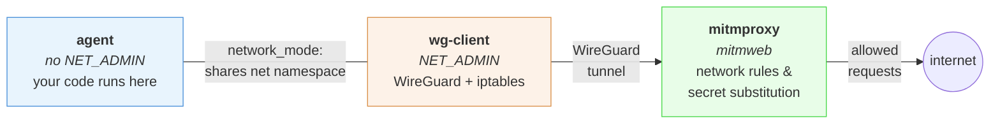
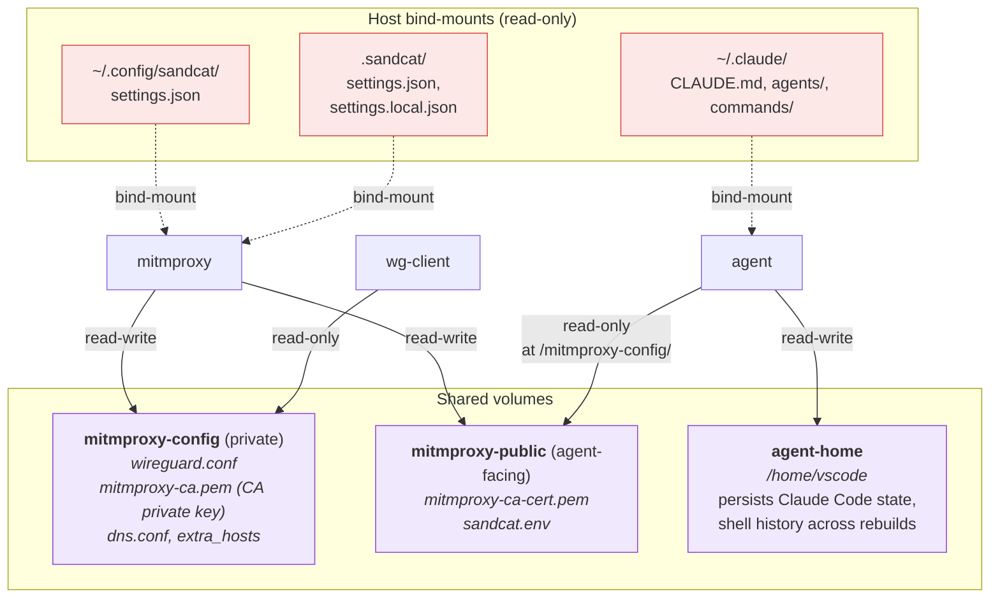
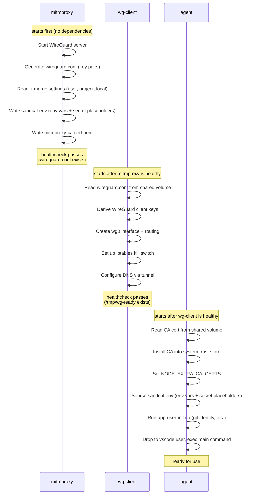

# Architecture

## Containers and network

- **mitmproxy** runs `mitmweb --mode wireguard`, creating a WireGuard server and
  storing key pairs in `wireguard.conf`.
- **wg-client** is a dedicated networking container that derives a WireGuard
  client config from those keys, sets up the tunnel with `wg` and `ip` commands,
  and adds iptables kill-switch rules. Only this container has `NET_ADMIN`. No
  user code runs here.
- **App containers** share `wg-client`'s network namespace via `network_mode`.
  They inherit the tunnel and firewall rules but cannot modify them (no
  `NET_ADMIN`). They install the mitmproxy CA cert into the system trust store
  at startup so TLS interception works.
- The mitmproxy web UI is exposed on a dynamic host port (see below) to avoid
  conflicts when multiple projects include sandcat. Password: `mitmproxy`.

## Volumes

The containers communicate through two shared volumes and several bind-mounts
from the host:

- **`mitmproxy-config`** is the private volume. Mitmproxy writes its WireGuard
  keys and CA material there (including the CA **private** key), plus the
  `dns.conf` and `extra_hosts` sidecars; only wg-client also mounts it, read-only.
  The agent never gets it — see issue #25.
- **`mitmproxy-public`** is the agent-facing volume, holding only what the
  sandbox legitimately needs: the CA **certificate** and `sandcat.env` (env vars
  and secret placeholders). Mitmproxy writes it; the agent mounts it read-only
  at `/mitmproxy-config/`, which is why paths inside the agent still start with
  that prefix.
- **`agent-home`** persists the vscode user's home directory across container
  rebuilds (Claude Code auth, shell history, git config).
- **Settings files** are bind-mounted from the host into mitmproxy only — app
  containers never see real secrets. The user settings file
  (`~/.config/sandcat/settings.json`) and the project settings directory
  (`.sandcat/`) are both mounted read-only.
- **Claude Code customizations** (`CLAUDE.md`, `agents/`, `commands/`) and
  **Cursor host config** (`~/.cursor/*` — see Cursor section above) are
  bind-mounted from the host when enabled in `compose-all.yml`. Per-path toggles
  are described in [Customizing optional volume mounts](../configuration/volume-mounts.md).

## Agent container hardening

The agent container is where untrusted code runs, so beyond the network
boundary it is stripped of every escalation path it does not need:

- **`no-new-privileges`** — the agent service runs with
  `security_opt: no-new-privileges`, so no process inside can gain
  privileges through setuid/setgid binaries or file capabilities.
- **No sudo** — the base devcontainer image grants the `vscode` user
  passwordless sudo; sandcat's `Dockerfile.app` removes that grant
  (`rm -f /etc/sudoers.d/vscode`). Root-phase setup runs in the entrypoint
  before it drops to `vscode` via `gosu`; nothing in the sandbox needs sudo
  afterwards. Combined with `no-new-privileges`, `sudo` is blocked twice
  over even if reinstalled.
- **No `NET_ADMIN`** — only `wg-client` holds it. The agent shares
  wg-client's network namespace, so it *sees* the tunnel, routing tables,
  and iptables kill switch, but cannot modify any of them.
- **No key material** — the agent mounts only the `mitmproxy-public`
  volume (CA *certificate*, `sandcat.env`); the CA private key and
  WireGuard keys stay on the private volume it never sees (see
  [Volumes](#volumes) above).
- **Read-only sandbox config** — `.devcontainer/` is overlaid read-only on
  the workspace mount, so the agent cannot rewrite its own entrypoint,
  compose files, or `devcontainer.json`.

With `--ide jetbrains` the agent additionally gets
`DAC_OVERRIDE`/`CHOWN`/`FOWNER` (the backend IDE manages files it does not
own) — still under `no-new-privileges` and still without `NET_ADMIN`. The
IDE-side trust boundary is covered separately in
[VS Code → Security hardening](../ide/vscode.md#security-hardening).

## Startup sequence

The containers start in dependency order. Each step writes data to the shared
volumes that the next step reads — `mitmproxy-config` for wg-client, and
`mitmproxy-public` for the agent:

