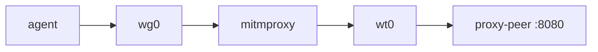
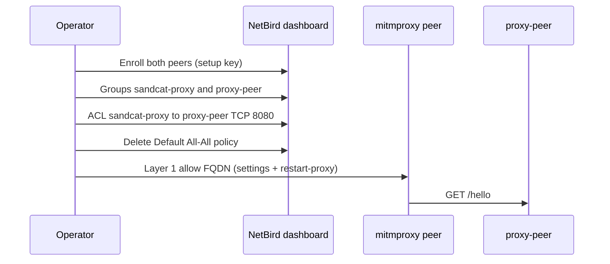

# Proxy-peer gateway (manual)

Sandcat does not create this container. It is a NetBird-enrolled HTTP service
(`GET /hello` on port 8080) you run with Docker Compose beside a project
initialized with `sandcat init --netbird`.

## Prerequisites

- A running NetBird management server ([../netbird-server](../netbird-server/))
- `sandcat init --netbird` already done; mitmproxy enrolled
- Setup key and API token (literals in `.env` for this example)

## Data path



Agent traffic is Layer 1–filtered in mitmproxy, then forwarded on `wt0` to the gateway.

## Policy path



## 1. Start the gateway

```bash
cp .env.example .env
# Fill NB_SETUP_KEY, NB_MANAGEMENT_URL, NB_API_TOKEN
docker compose --env-file netbird.env --env-file .env -f compose-proxy-peer.yml up -d --build
```

Default `NB_PEER_NAME` is `proxy-peer`.

## 2. Confirm enrollment

Open the NetBird dashboard **Peers** page. You should see `proxy-peer` and the
mitmproxy peer (`{project}-proxy`).

## 3. Layer 1 allow rule

Merge [settings-proxy-peer.json](settings-proxy-peer.json) into the project's
`.sandcat/settings.json`. Reload: `sandcat restart-proxy`.

If the dashboard FQDN still has an IP suffix, put that FQDN in the Layer 1
`host` field instead of `proxy-peer.netbird.selfhosted`.

## 4. Access control

NetBird accounts start with a Default policy (`All` ↔ `All`, any protocol).
New policies do nothing until you delete it.

1. **Access Control → Groups:** create `sandcat-proxy` and `proxy-peer`.
2. **Peers:** assign the mitmproxy peer to `sandcat-proxy`, the gateway to `proxy-peer`.
3. **Access Control → Policies:** add unidirectional TCP **8080**,
   source `sandcat-proxy`, destination `proxy-peer`.
4. Delete the Default `All` ↔ `All` policy.

Do not create a Network or a legacy Route for this hello service. Those are for
CIDRs behind a routing peer, not for a process listening on the peer itself.

## 5. Smoke

```bash
sandcat run curl -sS http://proxy-peer.netbird.selfhosted:8080/hello
```

Expect `{"service": "proxy-peer", "ok": true}`.

## Layout

| File | Role |
|------|------|
| `Dockerfile.proxy-peer` | Debian image with pinned NetBird client |
| `compose-proxy-peer.yml` | Standalone compose service |
| `netbird.env` | Client version + checksums |
| `.env.example` | Literal secret placeholders |
| `scripts/proxy-peer-init.sh` | Enroll + hello server |
| `settings-proxy-peer.json` | Layer 1 allow-list example |
