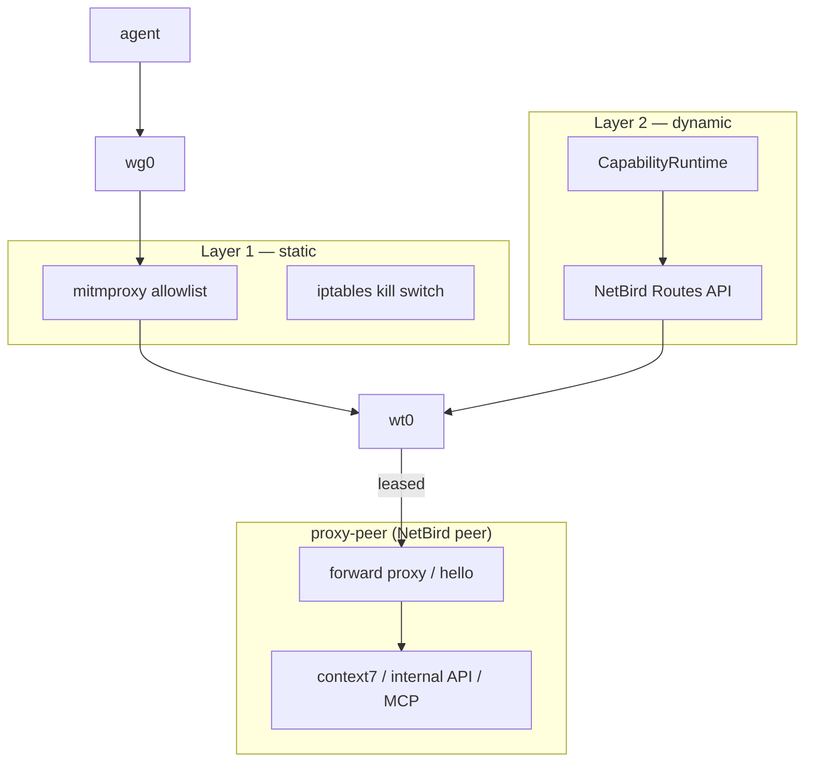

# Capability Proxy-Peer Gateway (Phase 3e) — Design Spec

> **Date:** 2026-07-08
> **Status:** **DRAFT** — approved direction; pending implementation
> **Scope:** Deploy a dedicated NetBird **proxy-peer** as a controlled gateway to protected upstreams (HTTP APIs, MCP proxies, paid SaaS). Sandcat uses a **two-layer control model**: static egress baseline (mitmproxy) + dynamic lease/revoke/quota (CapabilityRuntime ↔ NetBird Routes API).

**Prerequisite:** [Phase 3c — NetBird Policy Sync](./2026-06-30-capability-netbird-policy-sync-phase3c-design.md) (engineering gate complete)

**Follow-up:** [Phase 3d — Gateway metering slice](./2026-06-30-capability-agent-network-phase3d-design.md) (Agent Network / token budgets on proxy-peer upstreams)

**Ergonomics amendment:** [Proxy-Peer NetBird DNS Targeting](./2026-07-20-proxy-peer-netbird-dns-design.md) — stable peer hostnames replace per-recreate IP edits in catalog + Layer 1

**Consumer:** [Phase 4 Comparative Evaluation](./2026-06-23-capability-comparative-evaluation-phase4-design.md) — benchmark tasks E2, E7, E8

---

## 1. Problem

Phase 3c proves lease/revoke drives NetBird route enable/disable for a mesh target. Real deployments need:

| Gap | Today |
|-----|-------|
| **Trust zones** | Catalog points at arbitrary peers/CIDRs; no dedicated gateway pattern |
| **Bypass risk** | mitmproxy may allow broad hosts; agent could reach SaaS directly if static rules permit |
| **Paid / sensitive upstreams** | No standard place to hold API keys (context7, internal APIs) away from agent |
| **Usage throttling** | `record_action` + quota exists logically but is not wired from egress flows |
| **Two-layer story** | Layer 1 (static menu) vs Layer 2 (dynamic lease) is implicit, not operationalized |

---

## 2. Two-layer control model

```text
Layer 1 — Static baseline (always on)
  iptables kill switch + mitmproxy allowlist
  → defines what destinations can EVER leave the agent stack
  → deny-by-default; allow proxy-peer mesh IP:port only (+ infra mirrors)

Layer 2 — Dynamic lease (operator/agent MCP)
  CapabilityRuntime bundle + NetBird route enable/disable
  → defines WHEN a declared capability is reachable
  → revoke / quota exhaustion / TTL closes the route (circuit breaker)
```



**Invariant (unchanged):** agent egress still flows **wg0 → mitmproxy → wt0**. proxy-peer is a **mesh peer**, not a bypass around mitmproxy.

---

## 3. Goals

1. **proxy-peer container** — enrolls as NetBird peer (`NET_ADMIN`), exposes minimal HTTP surface on mesh IP.
2. **Layer 1 template** — sandcat settings profile allowing only proxy-peer gateway (FQDN `peer-proxy.netbird.selfhosted` in DNS mode, or mesh IP as fallback).
3. **Layer 2 catalog** — network capabilities map to `proxy-peer` `/32`; lease/revoke uses existing `route_enable` sync. Catalog prefers `dns_label` for stable targeting across recreates.
4. **Catalog-driven lease policy** — per-cap `quota`, `ttl` for network caps (e.g. context7 `action_quota: 5`).
5. **Flow → quota** — mitmproxy post-hoc `l7_flow` record decrements quota via admin RPC (closes Phase 3c Task 6 gap).
6. **Engineering gate** — scripted smoke: lease → curl proxy-peer → revoke → unreachable; quota → auto-revoke. Smoke target is `peer-proxy.netbird.selfhosted` when NetBird DNS is enabled (IP fallback documented).

---

## 4. Non-Goals (Phase 3e)

- NetBird **Networks** policy objects (migrate in Phase 3f; 3e stays Routes API)
- Per-request mitmproxy ↔ bundle RPC deny path (deprecated)
- Full MCP workload gateway on proxy-peer (stub path prefix only)
- Agent Network LLM proxy (Phase 3d)
- Proxy-peer holding production secrets for all SaaS (hello + one upstream stub sufficient for gate)

---

## 5. proxy-peer deployment

### 5.1 Topology

- **Separate compose stack** (`compose-proxy-peer.yml`) started by operator alongside sandcat devcontainer — not in agent network namespace.
- Same `NB_SETUP_KEY` and management URL as wg-client.
- Container name: `proxy-peer`; publishes no host ports (mesh-only reachability).

### 5.2 Runtime

1. Install NetBird (reuse `netbird.env` pin from wg-client).
2. `netbird up` with setup key; management URL from env (host IP for self-hosted).
3. Run `proxy-peer-hello.py` — HTTP server on `0.0.0.0:8080` returning JSON with peer mesh IP and capability path stubs.

### 5.3 Operator workflow

```bash
sandcat init --netbird --capability --proxy-peer --name demo
# edit capability-catalog.json with proxy-peer peer_id + mesh /32
docker compose -f .devcontainer/sandcat/compose-proxy-peer.yml up -d
sandcat compose up -d
```

---

## 6. Catalog extension

```json
{
  "name": "reach_proxy",
  "ref": "cap-reach-proxy",
  "type": "network",
  "peer_id": "<proxy-peer-id>",
  "network": "<proxy-peer-mesh-ip>/32",
  "sync_mode": "route_enable",
  "proxy": {
    "port": 8080,
    "path_prefix": "/hello"
  },
  "lease_policy": {
    "quota": 5,
    "ttl_minutes": 15,
    "token_budget": 10000
  }
}
```

| Field | Purpose |
|-------|---------|
| `proxy.port` | Documented target for mitm allowlist + smoke curl |
| `proxy.path_prefix` | Future upstream routing on proxy-peer |
| `lease_policy` | Overrides PoC hardcoded quotas in `runtime.request_capability_lease` |

---

## 7. Layer 1 — mitmproxy profile

Template `cli/templates/settings-proxy-peer.json`:

```json
{
  "network": [
    {
      "action": "allow",
      "host": "REPLACE_PROXY_PEER_MESH_IP",
      "port": 8080
    }
  ]
}
```

`sandcat init --proxy-peer` copies this to project settings guidance; operator replaces mesh IP after first `proxy-peer` enrollment.

---

## 8. Layer 2 — lease / quota / revoke

Uses existing Phase 3c paths:

| Event | Bundle | NetBird |
|-------|--------|---------|
| Lease | Cap visible | Route enabled to `/32` |
| Revoke | Cap removed | Route disabled |
| Quota exhausted | Revoke + cap removed | Route disabled |
| TTL expired | Expired state | Route disabled (best-effort) |

**New in 3e:** mitmproxy emits `l7_flow` → admin `capability.l7.record` → `record_action` when `host` matches leased network capability's proxy peer.

---

## 9. Success criteria (engineering gate)

- [ ] `proxy-peer` enrolls; `sandcat netbird status` lists second peer with mesh IP
- [ ] Layer 1 mitm profile blocks direct `curl https://example.com` from agent
- [ ] Without lease: `curl http://<mesh-ip>:8080/hello` fails (timeout / no route)
- [ ] With lease: hello JSON succeeds through mitmproxy
- [ ] Revoke: hello unreachable within 30s
- [ ] Quota=2: third flow triggers revoke + route disable
- [ ] JSONL shows `capability_leased`, `quota_decremented`, `capability_revoked`, `physical_sync`

---

## 10. Relationship to other phases

| Phase | Relationship |
|-------|--------------|
| 3c | **Prerequisite** — route enable/disable on lease lifecycle |
| 3d | **Extends** proxy-peer with upstream metering / Agent Network for LLM |
| 3f (future) | NetBird Networks + deny-by-default policies |
| 4 | **Measures** two-layer model in E2, E7, E8 |

---

## 11. Further reading

- [Phase 3c spec](./2026-06-30-capability-netbird-policy-sync-phase3c-design.md)
- [Phase 3e implementation plan](../plans/2026-07-08-capability-proxy-peer-gateway-phase3e.md)
- [CONTEXT.md](../../../CONTEXT.md)
